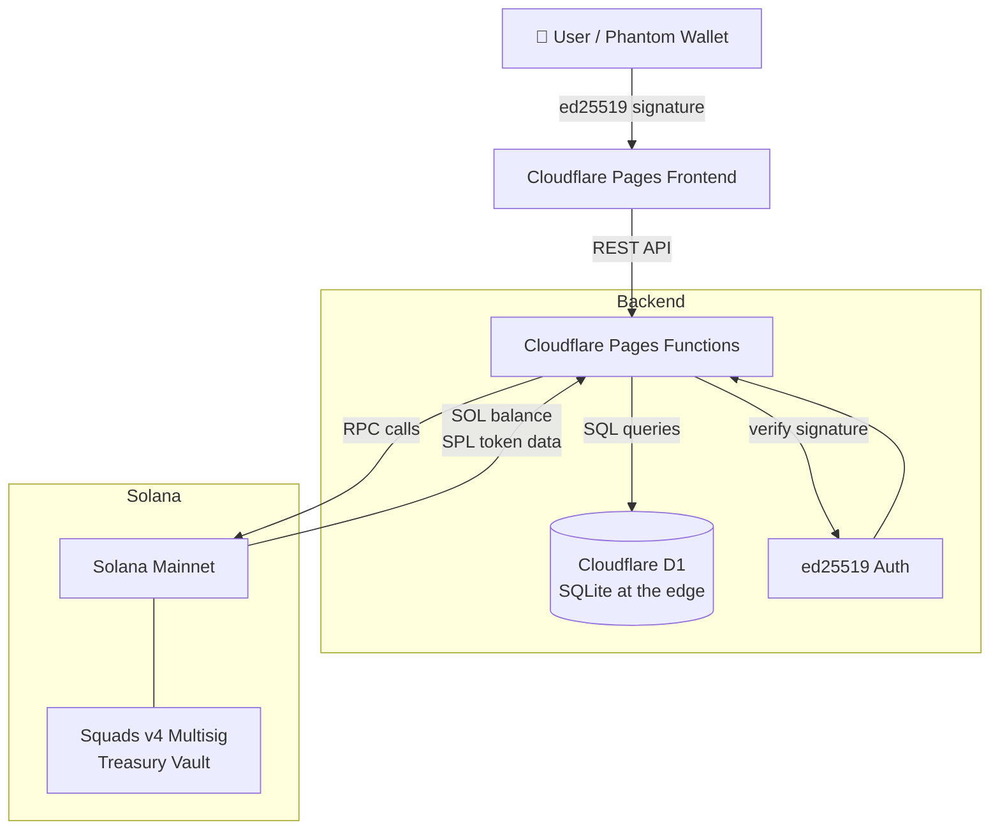

# voting-engine

> Open source toolkit to launch your own fully custom DAO on Solana — paying only the minimum network fees.


---

## 💸 Why voting-engine vs Realms?

| | **voting-engine** | **Realms.today** |
|---|---|---|
| Cost to launch DAO + token | **~0.01 SOL** | ~4 SOL |
| Hosting | Cloudflare free tier | Platform-dependent |
| Customizable branding | ✅ Full control | ❌ Fixed UI |
| Custom voting weights | ✅ Per-member multipliers | Limited |
| Open source | ✅ MIT — own your code | ❌ Closed platform |
| Self-hostable | ✅ Deploy anywhere | ❌ |
| Treasury multisig | ✅ Squads v4 | ✅ |
| Admin audit log | ✅ Cryptographic | ❌ |

> The **~0.01 SOL** covers the SPL token creation rent (~0.002 SOL) and the token metadata account (~0.008 SOL).  
> Everything else — hosting, database, API — runs on Cloudflare's free tier with **zero ongoing cost**.

---

## What is this?

**voting-engine** is an open source, self-hostable governance platform that lets any organization or community launch a fully custom DAO on Solana in minutes — with its own token, weighted voting, treasury, and admin panel — for as little as **~0.01 SOL** in network fees.

No recurring platform fees. No locked-in vendor. You own the code, the data, and the infrastructure.

Members connect their Phantom wallet, sign votes cryptographically, and the platform records everything in a Cloudflare D1 edge database with full audit trails. Hosting runs entirely on Cloudflare's **free tier**.

---

## Architecture



---

## What can it do?

### 📋 Proposals
- Create, browse, filter and search governance proposals by status and category (Governance, Treasury, Technical, Community)
- Three display modes: Grid, Large Cards, List
- Pinned proposals, discussion links, custom voting windows with date picker
- Anti-spam deposit system: proposals require a 0.05 SOL deposit — refunded if passed, credited to treasury if rejected

### 🗳️ Voting
- One wallet, one vote — enforced at the database level
- Weighted voting with configurable reputation multipliers per member
- Vote options: Yes / No / Abstain, with optional reasoning
- Every vote is cryptographically signed by the voter's Solana wallet and verified server-side with ed25519

### 👥 Members & Reputation
- Whitelisted voter directory with tiers (Council Core, VIP, Active Voter)
- Custom wallet aliases — members sign their alias with their wallet to claim it
- Per-member voting power multipliers configurable by admins
- Member stats: total members, avg multiplier, total voting power

### 🏦 Treasury
- Live SOL balance fetched from Solana RPC
- Squads v4 multisig vault integration
- 1-click SOL deposit via Phantom
- Admin-gated withdrawals
- Full financial operations history with CSV export for audit reports
- Separate token reserve tracker ($ATTEST governance token, 1M supply)

### 📊 Analytics
- Participation rates, quorum tracking, proposal pass/fail ratios
- Live SOL/USD price oracle for fee labels

### 🔐 Admin Panel
- Wallet-signature authenticated — only registered admin wallets can access
- Manage admin wallets, member whitelist and tiers, voting parameters (quorum %, duration, strategy)
- Configure branding: DAO name, logo, announcement banner, social links
- Cryptographic audit log of every admin action
- Maintenance mode toggle

---

## Tech stack

| Layer | Technology |
|-------|-----------|
| Frontend | Vanilla HTML + Tailwind CSS + JavaScript |
| Backend | Cloudflare Pages Functions (edge, serverless) |
| Database | Cloudflare D1 (SQLite at the edge) |
| Auth | Solana ed25519 wallet signature verification |
| Chain | Solana mainnet (SPL Token, Phantom wallet) |
| Calendar | Flatpickr (dark theme) |
| Fonts | Inter + Outfit (Google Fonts) |

---

## Database schema

```
proposals          → governance proposals (status, category, timing)
votes              → signed votes (wallet, choice, power, reason)
admin_config       → DAO settings (name, quorum, token, links)
whitelist_voters   → member whitelist (tiers, multipliers)
admin_audit_logs   → cryptographic log of every admin action
```

---

## API surface

| Endpoint | Description |
|----------|-------------|
| `GET /api/proposals` | List proposals with filters |
| `POST /api/proposals` | Create proposal (admin) |
| `GET /api/proposal?id=` | Single proposal detail |
| `POST /api/vote` | Cast a signed vote |
| `GET /api/members` | Member directory |
| `GET /api/treasury` | Treasury balances and transactions |
| `GET /api/stats` | DAO-wide analytics |
| `GET /api/config` | Public DAO configuration |
| `POST /api/admin` | Admin actions (signature-gated) |
| `GET/POST /api/profile` | Voter alias and profile |

---

## Security model

- **No passwords.** Every action is authenticated by a Solana wallet signature.
- Admin actions require a valid ed25519 signature from a registered admin wallet, verified server-side.
- Votes are tied to wallet address + proposal — duplicates are rejected at the DB constraint level.
- HTTP security headers: HSTS, CSP, X-Content-Type-Options, X-Frame-Options.
- Admin audit log captures every configuration change with signature proof.

---

## Deployment

See **[DEPLOYMENT.md](./DEPLOYMENT.md)** for full setup and deploy instructions.
